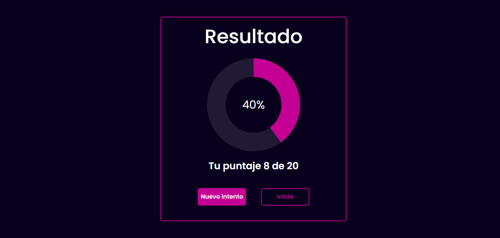

# Quiz Website


## Descripción

¡Bienvenido a la aplicación de Quiz Website! Esta aplicación te permite poner a prueba tus conocimientos en JavaScript con una serie de preguntas y respuestas de opción múltiple. Al finalizar el quiz, podrás ver tu puntuación y volver a intentarlo para mejorar tu resultado.

## Características

- **Preguntas de Opción Múltiple**: Responde preguntas variadas sobre JavaScript.
- **Puntuación**: Obtén una puntuación basada en tus respuestas correctas.
- **Interfaz Intuitiva**: Disfruta de una experiencia de usuario sencilla y atractiva.
- **Responsive Design**: Compatible con dispositivos móviles y de escritorio.

## Tecnologías Utilizadas

- HTML5
- CSS3 (Bootstrap)
- JavaScript

## Instalación

1. Clona este repositorio en tu máquina local:
    ```sh
    git clone https://github.com/ArtiedaLorena/quiz-website.git
    ```

2. Navega hasta el directorio del proyecto:
    ```sh
    cd quiz-website
    ```

3. Abre el archivo `index.html` en tu navegador web.

## Uso

1. En la página de inicio, haz clic en el botón para comenzar el quiz.
2. Lee cada pregunta y selecciona la respuesta que creas correcta.
3. Haz clic en el botón "Siguiente" para avanzar a la siguiente pregunta.
4. Al finalizar, se mostrará tu puntuación junto con un botón para intentar nuevamente o regresar al inicio.

## Capturas de Pantalla


*Pantalla de inicio de la aplicación.*


*PopUp que explica como iniciar el quiz.*


*Ejemplo de pregunta en el quiz.*


*Pantalla de resultados después de completar el quiz.*


## Autor

- **Lorena Artieda** - [GitHub](https://github.com/ArtiedaLorena)

